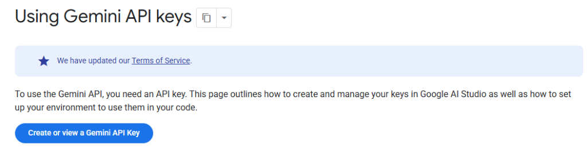
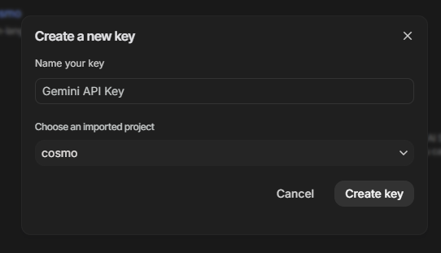
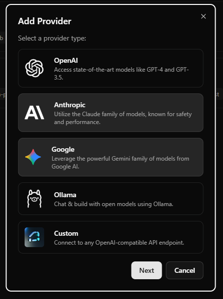

# 🔑 **How to Get Your Gemini API Key - A Complete Guide**

Getting started with Google's Gemini API is straightforward, but if you're new to the platform, navigating the setup process can feel a bit overwhelming. In this guide, we'll walk you through every step of obtaining your Gemini API key and integrating it into your application.

Whether you're building an AI-powered chatbot, experimenting with generative AI, or integrating Gemini into your workflow, this tutorial will get you up and running in minutes.

---

## 🌟 What Is the Gemini API?

The **Gemini API** provides access to Google's powerful family of generative AI models. With Gemini, you can:

- Generate human-like text responses
- Build conversational AI applications
- Create content, summarize documents, and more
- Leverage multimodal capabilities (text, images, and beyond)

To use the Gemini API, you'll need an **API key** — a unique identifier that authenticates your requests to Google's servers.

---

## 📋 Prerequisites

Before we begin, make sure you have:

- A **Google account** (if you don't have one, create one at [accounts.google.com](https://accounts.google.com))
- Access to **Google AI Studio** (available at [aistudio.google.com](https://aistudio.google.com))

---

## 🚀 Step-by-Step Guide to Getting Your Gemini API Key

### Step 1: Navigate to the Gemini API Documentation

Start by visiting the official Gemini API documentation at:

👉 [https://ai.google.dev/gemini-api/docs/api-key](https://ai.google.dev/gemini-api/docs/api-key)

This page provides comprehensive information about creating and managing your API keys, as well as best practices for securing them.



You'll see a blue button labeled **"Create or view a Gemini API Key"** — this is your gateway to Google AI Studio.

<!-- truncate -->

---

### Step 2: Access Google AI Studio

Click on the **"Create or view a Gemini API Key"** button. This will redirect you to:

👉 [https://aistudio.google.com/app/api-keys](https://aistudio.google.com/app/api-keys)

Google AI Studio is the central hub for managing your Gemini API keys. Here, you can create new keys, view existing ones, and monitor your API usage.


Once you're on the API keys page, you'll see a button labeled **"Create API key"** in the top-right corner.

---

### Step 3: Create Your API Key

Click on the **"Create API key"** button. A dialog box will appear prompting you to configure your new API key.



In this dialog, you'll need to:

1. **Name your key** (optional but recommended for organization)
   - Example: "Gemini API Key" or "My App API Key"

2. **Choose an imported project**
   - If you already have a Google Cloud project, select it from the dropdown
   - If you don't have a project yet, you can create a new one directly from this dialog

> **💡 Pro Tip:** If you're just getting started, creating a new project is quick and easy. Google will automatically set up the necessary configurations for you.

Once you've filled in the details, click the **"Create key"** button at the bottom of the dialog.

---

### Step 4: Copy Your API Key

After creating your API key, Google AI Studio will display it on the screen. **Make sure to copy this key immediately** — you won't be able to see it again later (though you can always create a new one if needed).

Your API key will look something like this:

```
AIzaSyD1234567890abcdefghijklmnopqrstuvwx
```

> **⚠️ Security Warning:** Treat your API key like a password. Never share it publicly, commit it to version control, or expose it in client-side code. Always use environment variables or secure secret management systems.

---

## 🔌 Integrating Your API Key into Your Application

Now that you have your Gemini API key, it's time to integrate it into your application. If you're using **Cosmo Studio** or a similar AI chat client, here's how to add your key:

### Step 5: Add the API Key to Your Provider Settings

1. Navigate to Cosmo Studio's **Settings** page
2. Click on **"Add Provider"**



3. Select **Google** from the list of available providers
4. Paste your Gemini API key into the designated field
5. Select the Gemini models you want to use (e.g., `gemini-pro`, `gemini-pro-vision`)
6. Click **"Next"** or **"Save"** to complete the setup

That's it! You're now ready to start using the Gemini API in your application.

---

## 🛡️ Best Practices for API Key Security

To keep your API key safe and prevent unauthorized usage:

- **Use environment variables**: Store your API key in a `.env` file and never commit it to Git
- **Restrict API key usage**: In Google Cloud Console, you can restrict your API key to specific IP addresses or referrer URLs
- **Rotate keys regularly**: Periodically create new API keys and delete old ones
- **Monitor usage**: Keep an eye on your API usage in Google AI Studio to detect any unusual activity
- **Use API quotas**: Set usage limits to prevent unexpected charges

---

## 🎯 What's Next?

Now that you have your Gemini API key set up, you can:

- **Explore the Gemini API documentation** to learn about available models and capabilities
- **Build your first AI application** using the Gemini SDK
- **Experiment with different prompts** to see what Gemini can do
- **Integrate multimodal features** like image understanding and generation

---

## 📚 Additional Resources

- [Gemini API Documentation](https://ai.google.dev/gemini-api/docs)
- [Google AI Studio](https://aistudio.google.com)
- [Gemini API Pricing](https://ai.google.dev/pricing)
- [Gemini API Quickstart Guide](https://ai.google.dev/gemini-api/docs/quickstart)

---

## 🙌 Conclusion

Getting your Gemini API key is the first step toward building powerful AI-driven applications. With Google's robust infrastructure and cutting-edge models, the possibilities are endless.

If you found this guide helpful, consider sharing it with others who might benefit. And if you're using **Cosmo Studio**, you now have everything you need to connect to Google's Gemini models and start chatting with AI!

Happy building! 🚀
