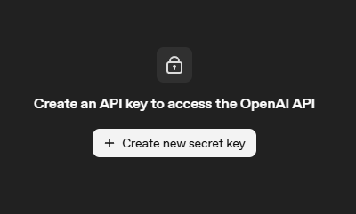
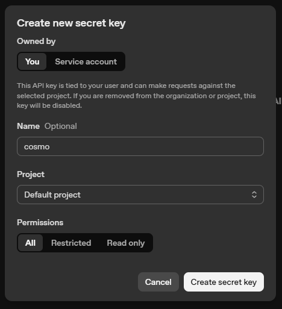

# 🔑 **How to Get Your OpenAI API Key - A Complete Guide**

Getting started with OpenAI's API is the gateway to using powerful models like GPT-5/x and o1/x. Whether you're building an AI application or using a tool like Cosmo Studio, obtainining your API key is a simple process. In this guide, we'll walk you through the exact steps to get your OpenAI API key. 

---

## 🌟 What Is the OpenAI API?

The **OpenAI API** provides access to state-of-the-art AI models developed by OpenAI. With this API, you can:

- Generate high-quality text and code
- Power intelligent chatbots and assistants
- Perform complex reasoning and data analysis
- Access vision and audio capabilities

To use these models, you'll need an **API key** — a secure token that identifies your account and tracks your usage.

---

## 📋 Prerequisites

Before we begin, make sure you have:

- An **OpenAI account** (if you don't have one, sign up at [platform.openai.com](https://platform.openai.com/signup))
- (optional) A valid payment method or credits on your OpenAI account (OpenAI uses a prepaid billing system)

---

## 🚀 Step-by-Step Guide to Getting Your OpenAI API Key

### Step 1: Navigate to the OpenAI API Keys Page

Start by visiting the official OpenAI API platform. Directly go to the API keys section:

👉 [https://platform.openai.com/api-keys](https://platform.openai.com/api-keys)

This page is where you manage all your secret keys.

<!-- truncate -->

---

### Step 2: Create Your Secret Key

Once you're on the API keys page, look for the section titled "API keys". 

Click on the **"Create new secret key"** button as shown below:

A dialog box will appear prompting you to configure your new API key.

In this dialog, you can:
1. **Owned by**: Select "You" (default) or a Service Account if applicable.
2. **Name (Optional)**: Give your key a descriptive name like "cosmo" or "Production".
3. **Project**: Choose the project this key should be tied to (usually "Default project").
4. **Permissions**: Set this to **"All"** for full access to models, or "Restricted" if you want to limit scope.

Click the **"Create secret key"** button at the bottom right to generate your key.

---

### Step 3: Copy and Secure Your API Key

After clicking create, a final popup will appear showing your unique secret key. 

**IMPORTANT**: Copy this key immediately (using the copy icon) and store it in a safe place. OpenAI will **not show this key to you again** for security reasons. If you lose it, you will have to create a new one.

> **💡 Pro Tip:** Unlike some other providers, OpenAI requires you to have a positive credit balance or a linked payment method for your API keys to work. If you receive a "quota exceeded" error, check your [Billing dashboard](https://platform.openai.com/settings/organization/billing/overview).

> **⚠️ Security Warning:** Your API key is like a password. Never share it, post it on social media, or commit it to GitHub. If a key is compromised, someone else could use your account credits.

---

## 🔌 Integrating Your API Key into Cosmo Studio

If you're using **Cosmo Studio** to interact with AI, here's how to plug in your new key:

1. Open **Cosmo Studio** and go to **Settings**.
2. Click on **"Add Provider"**.
3. Select **OpenAI** from the list.
4. Paste your secret key into the API Key field.
5. Select the models you'd like to use (e.g., `gpt-4o`, `o1-preview`).
6. Click **Save**.

Now you're ready to chat with OpenAI's most powerful models!

---

## 🛡️ Best Practices for API Key Security

To keep your account safe:

- **Use Usage Limits**: Set hard and soft limits in your [Billing settings](https://platform.openai.com/settings/organization/billing/limits) to avoid unexpected costs.
- **Rotate Keys**: Regularly delete old keys and create new ones.
- **Never hardcode**: Use environment variables (`.env` files) when developing applications.
- **Project Scoped Keys**: Use project-specific keys to limit the scope of access if one key is exposed.

---

## 📚 Additional Resources

- [OpenAI Platform Documentation](https://platform.openai.com/docs)
- [OpenAI Pricing Page](https://openai.com/api/pricing/)
- [OpenAI API Reference](https://platform.openai.com/docs/api-reference)

---

## 🙌 Conclusion

Obtaining your OpenAI API key is a quick process that unlocks a world of AI possibilities. By following these steps, you've taken the first step toward building or using next-generation AI tools.

If you found this guide helpful, check out our other tutorials on the blog. Happy building! 🚀
