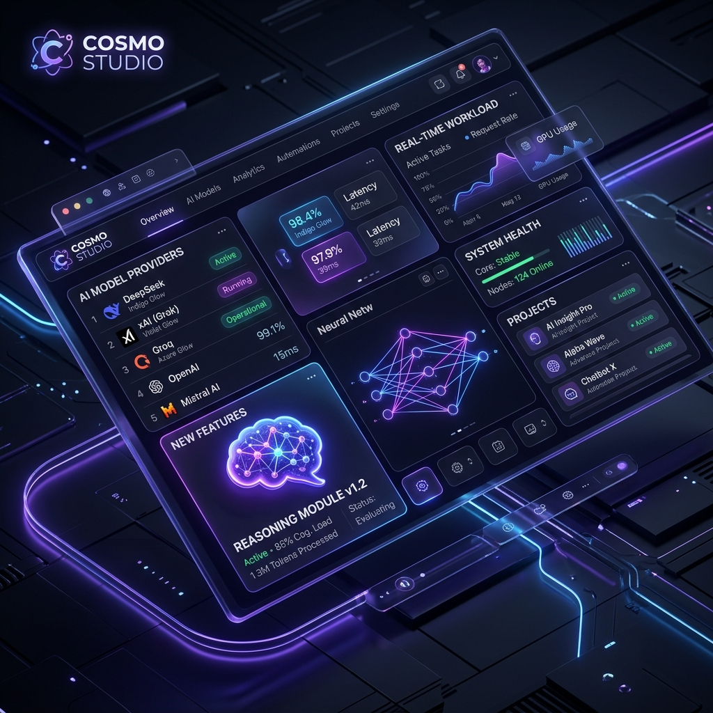

# 🚀 **Cosmo Studio 1.1.2 — The Ultimate AI Command Center Evolution!**

We are thrilled to announce the release of **Cosmo Studio v1.1.2**. This update brings a massive leap forward in how you interact with AI, introducing highly requested features like **Personas**, **MCP support**, and a dramatically improved messaging experience.

Whether you're a developer, a power user, or just getting started with AI, v1.1.2 is designed to make your workflow faster, smarter, and more intuitive.

<!-- truncate -->

---

## ✨ What's New in 1.1.2?

### 👥 **Personas**
Custom tailored AI experiences are now here! Create and switch between specialized **Personas** to give your AI assistants unique contexts, instructions, and behaviors. Whether you need a code reviewer, a creative writer, or a technical guide, Personas have you covered.

### 🧩 **MCP (Model Context Protocol)**
Expanding the horizons of what your AI can do! v1.1.2 introduces support for the **Model Context Protocol**, allowing for deeper integration and richer context sharing between models and external data sources.

### ⌨️ **Commands**
Efficiency is at the heart of Cosmo Studio. Use a suite of new **Commands** to navigate the app, trigger actions, and manage your AI workflows directly from your keyboard.

---

## 🌐 Expanded Provider Universe
We've added support for a wide array of new providers, giving you the freedom to choose the best model for ogni task:

- **xAI** / **Groq** / **Mistral**
- **Moonshot** / **DeepSeek** / **Perplexity**
- **Cohere** / **LMStudio** / **HuggingFace**

---

## 💬 Improved Chat & Messaging UX
We've completely overhauled the messaging experience to make it more transparent and controllable:

- **🧠 Thinking First:** Models that support "thinking" will now show their reasoning process before displaying the final message.
- **🏷️ Model Labels:** Each message now clearly displays the name of the model that generated it.
- **🛑 Stop Streaming:** Take control! You can now stop a model's response mid-stream.
- **📊 Token Usage:** Get detailed insights into the token consumption of each model directly in the chat.

---

## 🛠️ Performance & Quality
Under the hood, we've been working hard to make Cosmo Studio more stable and reliable:

- **General Fixes:** Improvements to Personas, Provider pages, and UI formatting.
- **Message Handling:** Enhanced encryption fallbacks and fixes for local chat history updates.
- **Refactoring:** Upgraded dependencies and improved testing across core, main, and renderer modules.
- **macOS Signing:** Fully signed builds for macOS for a smoother installation experience.

---

## 📦 Full Changelog
For a complete list of changes, check out the comparison:
[v1.0.1...v1.1.2 on GitHub](https://github.com/cosmo-cp/cosmo-studio/compare/v1.0.1...v1.1.2)

---

## 🙌 Join the Evolution
Cosmo Studio is built together with the community. If you haven't yet, [download the latest version](https://cosmocp.com/) and let us know what you think!

Stay tuned for more updates as we continue building the most powerful AI command center for your desktop.
